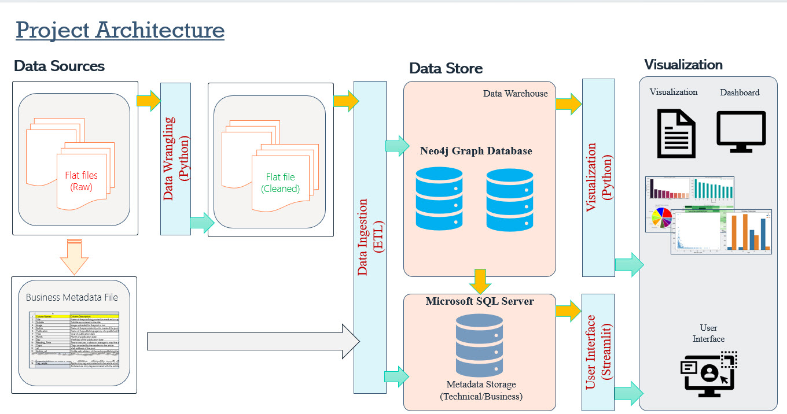
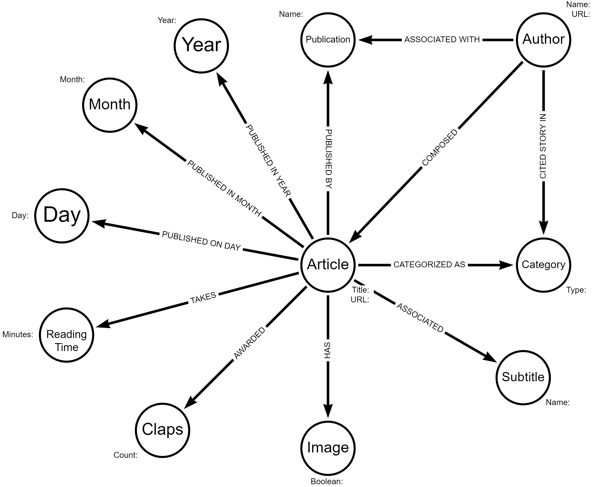
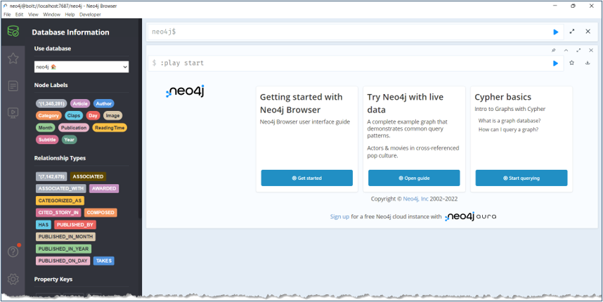

# Medium Data Analytics Leaderboard System

 

 

## Problem Definition

In this dataset sourced from Medium Blog (via Kaggle) portal, we need to design and implement a data engineering solution that can integrate, transform, and load this data into a NoSQL graph database, enabling the data analysts and scientists to easily access and analyze it. The ultimate goal of this data engineering solution is to enable our organization to make data-driven decisions, improve customer engagement, and drive business growth.

## Learning
This project has a strong emphasis on applied learning. The data was extracted, transformed and ingested into graph database to be futher analysed. I have also explored and applied exploratory data analysis and data visualizations to make better data driven decisions.

## Data Source

**Medium Stories Dataset** - The data-set consists of 1.4 million stories from 95 of Medium’s most popular story-tags. Every story was published between August 1st, 2017 and August 1st, 2018. The project leverages single data sources like Medium Blog datasource from Kaggle as desribed below.

- [Medium Stories](https://www.kaggle.com/datasets/harrisonjansma/medium-stories) - This dataset contains information about randomly chosen medium articles published in 2019 from these 7 publications:
    - Towards Data Science
    - UX Collective
    - The Startup
    - The Writing Cooperative
    - Data Driven Investor
    - Better Humans
    - Better Marketing
 
 ## Data Description

This dataset consists of below metadata information:

|              Data Source             |   Rows   |   Columns   |  Update Frequency |   File Format  |
|:------------------------------------:|:--------:|:-----------:|:-----------------:|:--------------:|
|               medium_data            |   354K  |       108    |       Unknown       |      csv       |

## Tools 

Below tools have been utilized for the various segments involving Data Profiling, Modeling, Integration and BI Reporting and Visualizations:

  
     
		
 	
     

 

  
     
		
 	
   

  
     
	<a href="#">
         
     

## Architecture Diagram

The architecture diagram for this system includes Python and Neo4j as its primary tools. Python is a powerful programming language that is well-suited for a wide range of applications, including data processing, analysis, and visualization. Neo4j is a graph database that is designed to store and manage large, complex networks of data.

In this system, Python is used to extract data from various sources, perform data transformations and analysis, and generate visualizations of the results. The data is then stored in Neo4j, where it can be easily queried and manipulated using Neo4j's powerful graph querying language.

The architecture diagram for this system would typically include components for data extraction, data processing, data storage, and data visualization. The data extraction component would involve using Python libraries to extract data from various sources, such as APIs and files. The data processing component would involve using Python to clean and transform the data, as well as perform any necessary analysis.

The data storage component would involve using Neo4j to store and manage the data in a graph database format. Neo4j is well-suited for this task because it is designed to handle large and complex networks of data. Finally, the data visualization component would involve using Python to generate visualizations of the data, such as charts, graphs, and dashboards.

Overall, the architecture diagram for this system highlights the key tools and components involved in processing and analyzing data using Python and Neo4j.
 

  
   
			
     
	Figure 1 : Medium Stories Analytics Architecture Diagram

 

## Data Model

This project leverages the capability of draw.io and arrow.app to design, visualize, and manage data model and metadata for the Neo4j graph database. Below is the data model for the Neo4j Medium database.

  
     
	<a href="#">
         
     

 
	
## Data Integration / ETL Pipeline

In this project, data is analysed, profiled, transformed and loaded into Neo4j graph database by using Cypher Query Language (CQL). The Data Cleansing and Data Wrangling actions are performed using Python standard libraries (like Pandas and ydata-profiling).

The cleaned and transformed data is then ingested into Neo4j to be used further for visualizations and analytics for data driven decisions.

  
     
	<a href="#">
         
     

 

The ETL process involved 2 layer of data landing, transformation and loading.
